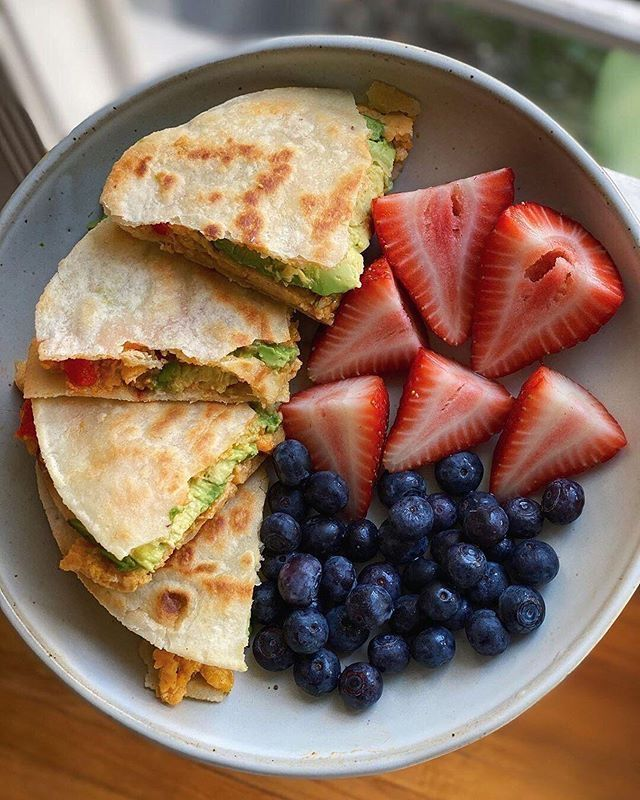

## Definición de OSOHUB

OSOHUB es una plataforma diseñada específicamente para la fotografía de comida, 
ofreciendo una experiencia visual única y centrada en el contenido gastronómico. 
A diferencia de otras redes sociales, OSOHUB elimina las distracciones y permite 
a los usuarios sumergirse completamente en la estética culinaria.

